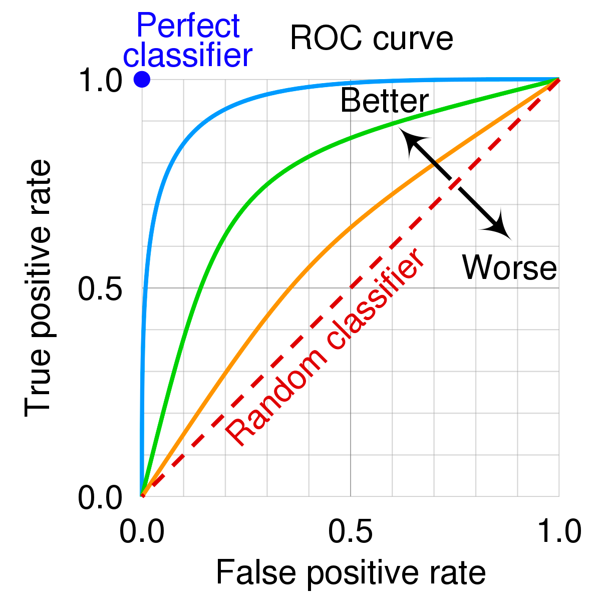
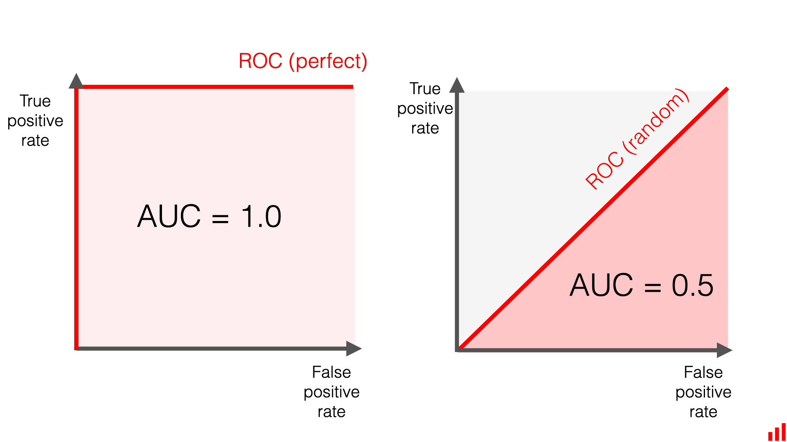
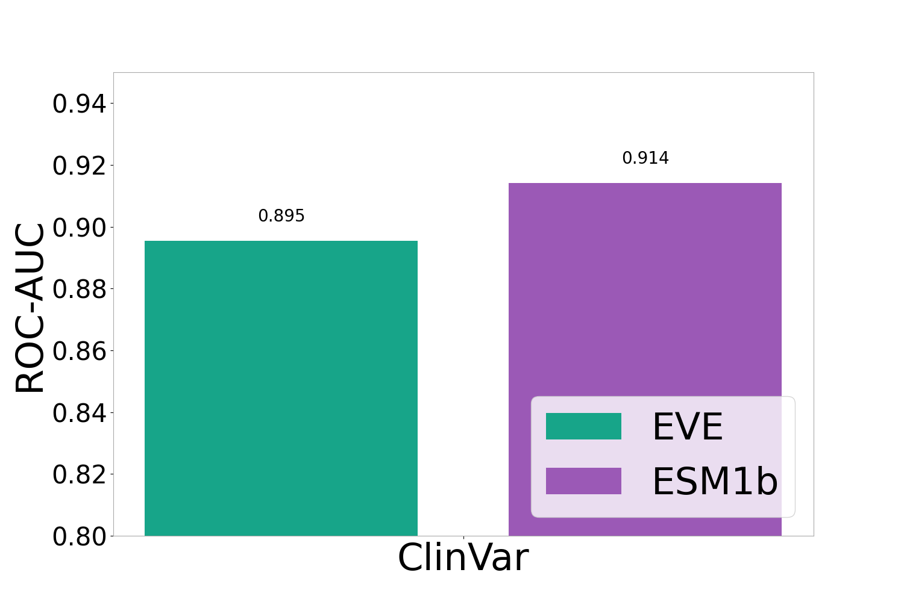

# ROC-AUC Figure 2B
* This Markdown document contains background information about the Receiver Operating Characteristic (ROC) Area Under the 
Curve (AUC) in the context of the paper's Figure 2B.
  * Figure 2B compares the ROC-AUC scores between ESM1b and Evolutionary model of Variant Effect (EVE) in regards to
ClinVar
* It also explains the methods used to calculate the ROC-AUC scores and display Figure 2B. 
## What is the ROC?

* The ROC curve is a graphical representation of a model's ability to distinguish between classes
* It plots the True Positive Rate against the False Positive Rate
  * **True Positive Rate (TPR)**: the proportion of actual positive samples correctly predicted
  * **False Positive Rate (FPR)**: the proportion of false positive samples incorrectly predicted
* In the paper's context, we are looking at the correlation between our variant ESM1b scores and if ClinVar marks them
pathogenic
  * The TPR should increase if our variants with significant ESM1b scores show up as pathogenic in ClinVar
## What is the AUC?

* The Area Under the Curve (AUC) quantifies the overall performance of a classification model
* It measures the model's ability to distinguish between positive and negative classes
* It ranges from 0-1
  * 0.5 = random classification
  * 1 = perfect classification
* In the paper's context, an AUC value closer to 1.0 would mean that a model is better at detecting pathogenic variants
ClinVar
## Methods
### Required Modules
* pandas
* numpy
* matplotlib.pyplot
* roc_auc_score from sklearn.metrics
### Breakdown of Python Code (roc_auc.py)
* Used pandas to read **final_updated_file_two.csv** which contains our calculated ESM1b scores
  * Also contains EVE scores and ClinVar information
* Calculated ROC-AUC scores using the function **roc_auc_score** on the benchmark dataset
* Displayed data using **plt.subplots** 
## Figure 2B

## Acknowledgements
Brandes, N., Goldman, G., Wang, C. H., Ye, C. J., &amp; Ntranos, V. (2023, August 10). Genome-wide prediction of disease variant effects with a deep protein language model. Nature News. https://www.nature.com/articles/s41588-023-01465-0 

Kilic, I. (2023, September 19). ROC curve and AUC: Evaluating model performance. Medium. https://medium.com/@ilyurek/roc-curve-and-auc-evaluating-model-performance-c2178008b02
